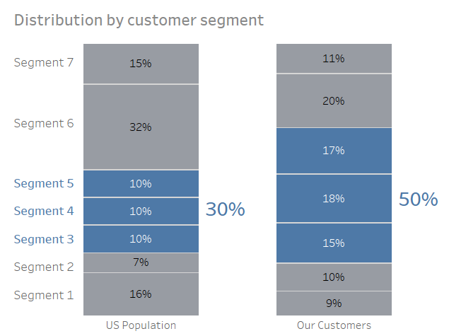

# About

There have been recreations in Python, R, Highcharts of plots in Cole Nussbaumer Knaflic ‘s book [Storytelling With Data](https://www.storytellingwithdata.com/book/downloads). Here I try to reproduce them using Tableau and giving my understanding of those plots.

# Principles

I will not reproduce those charts 100% the same as the original one, eg. tracking exactly the same color, layout, fonts, etc. Instead, I will try to capture the author’s thinking and adjust them based on my ideas and gives some tricky usage of Tableau.

# Main problems of visualizations

The role of visualization is to simplify the data and convey insights to the audience. So anything below that may hinder achieving this goal will become a defect:
1. Bad alignment.
2. Various colors.
3. Unnecessary gridlines, bolding, font types, font sizes, inclined characters, character shapes, etc.
4. Not enough focus on the data you are interested in.
5. Inappropriate chart type.

# Table of Contents
*. [Figure 3.13](#fig3.13)
*. [Figure 3.15](#fig3.15)
*. [Figure 3.19](#fig3.19)
*. [Figure 5.2](#fig5.2)
*. [Figure 5.12](#fig5.12)
# Figures & Analysis

## Figure 3.13

### Defects

1. Bad alignment: centering is messy for words
2. The selected 3 are not emphasized, unimportant words in the title, header, and annotation arrow are bold instead.
3. The scales are inclined, which increases the difficulty of reading.

### Improvements

### My modifications

*. Change the language in the description and make the bold words less.
*. Change the color of the selected bars so that people can first notice these instead of texts that are also black and bold.

### Tricks

* To adjust the space between the title and the description in Tableau, we can insert one row in the between, select its size to adjust the space, and paint it white.
*. The texts in the right column are added in the dashboard.
*. Separating “Survey shows that” and the following words makes it easier to read.
*. If there are not any explanations in the right columns, we can make the headers of the chosen 3 blue to emphasize them. However, it is not easy to do so in Tableau.

## Figure 3.15

### Defects

1. Various colors and shapes are confusing.
2. The index of our services is not emphasized. 
3. Negative data are not necessary, which can be shifted to positive.

### Improvements

### My modifications
*. I don’t know how to adjust the distance between bars for different headers, so I just use the divided line.
*. Strangely, the legend is under the title. I put the legend aside.

### Tricks

*. In Tableau, the rankings are labeled to every bar. To only label our service, we need to first choose “Never Show” in right-click -> Mark Label, then choose “Always Show” one by one.

## Figure 3.19

### Defects
1. Unnecessary gridlines, out border
2. Extra digits after decimal on the scale
3. Unnecessary data point marker types
4. Inclined date headers
5. It does not show that at a certain time things changed, the processed tickets are much less than they received.

### Improvements

### My modifications
*. I add the title which shows that the plot is about ticket volume.

### Tricks
*. To make room for the text in the dashboard, we can use another text object as the blank. 

## Figure 5.2

### Defects
1. Bar charts are not appropriate for time series.
2. Legend colors’ change with time is confusing.
3. Unnecessary bold “ PEW RESEARCH CENTER”.
4. Better focus on one education type. 

### Improvements

Note: Another improved chart is Figure 5.10. It requires extra info so I don't put it here. 

### Tricks
*. The title is added in the dashboard using the Text Objects.

## Figure 5.12

### Defects
1. Various colors make people confused.
2. The left headers are not aligned.
3. The dotted line in the middle is a bit strange and unnecessary.

### Improvements

### Tricks
*. The colors in Tableau’s stacked bar chart are next to each other. To make the distance between them, I insert blank percentage (0.5%) between the segments data in the tables.

